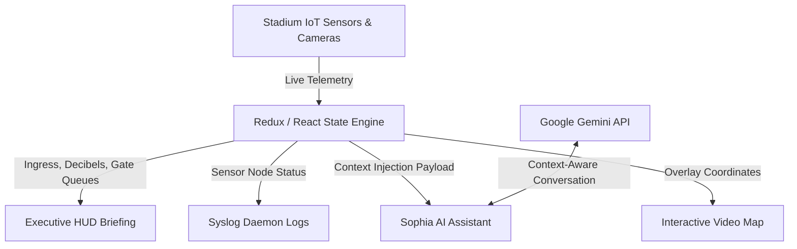

# 🏟️ ArenaAI — FIFA World Cup 2026 Smart Stadium Intelligence

> **Category**: Smart Stadiums & Tournament Operations (PromptWars 2026 Entry)
> 
> *A next-generation Generative AI-powered Command Center engineered to optimize match-day stadium operations, crowd safety, and fan experience for the world's largest sporting event.*

---

## 🌟 The Vision

Managing the logistics of a **FIFA World Cup** stadium requires coordinating crowd flows, security protocols, environmental sensors, and gateway access points across tens of thousands of fans per minute. 

**ArenaAI** bridges the gap between raw, complex IoT sensor data and operational decisions. It provides stadium administrators and logistics coordinators with a cinematic, real-time control cockpit. By injecting live telemetry directly into a localized GenAI assistant (Sophia), ArenaAI translates complex network telemetry, crowd decibels, and gateway wait times into natural language status summaries and proactive mitigations.

---

## 🚀 Key Innovation Highlights

### 1. Context-Aware GenAI Assistant (Sophia AI)
- Powered by Google's `gemini-flash-latest` model.
- **Dynamic Telemetry Injection**: We inject live, real-time stadium metrics (active spectators, current score, gate wait times, security status, and HVAC temperatures) directly into the model's system context.
- **Proactive Coordination**: Sophia does not just reply to queries; she tracks active gates, coordinates medical units, and recommends crowd routing adjustments based on live telemetry inputs.

### 2. Live Video Telemetry Overlay Map
- Replaces traditional blocky 3D renderings with a **real-time drone feedback video map**.
- Designed precision interactive SVG polygon coordinate shapes mapped directly on top of the grandstands and gateways.
- Clicking on coordinates exposes live section occupancy rates, medical status, and gate wait queue projections in the detail telemetry console.

### 3. Asymmetrical Bento-Grid System Control
- A data-rich command center that balances density with user readability.
- **Executive Status Briefing**: A premium HUD banner that translates dense, technical node pings into a simplified human summary (e.g. *"MetLife Arena is operating at 98% efficiency. Average wait times are under 3 minutes."*).
- **syslog_daemon Logs**: A live-updating terminal log presenting JSON pings, scanner handshakes, and sensor packet reports in real time for advanced administrators.
- **sensor_grid_node_matrix**: An active grid tracking 16 IoT sensor points across stadium zones.

---

## 🛠️ Built With the Modern Stack

- **Core Framework**: React 19 + Vite 8
- **Styling**: Tailwind CSS v4 (micro-bordered frosted glass, aurora backdrops, gold accents)
- **Animations**: Framer Motion 12 (scroll-linked Ken Burns zooms, mouse-parallax layers, lens flares, and floating bokeh motes)
- **Charts**: Recharts (custom minimized curves and vertical gradients)
- **API**: Google Gemini API (`generativelanguage.googleapis.com`)

---

## ⚙️ Quick Setup

### 1. Prerequisites
Ensure you have [Node.js](https://nodejs.org/) installed.

### 2. Installation
Clone the repository and install the dependencies:
```bash
git clone https://github.com/k-a-v-i-n-0-0-2/promptwars.git
cd promptwars
npm install
```

### 3. Environment Variables
Create a `.env` file in the root directory and add your Gemini API Key:
```env
VITE_GEMINI_API_KEY=YOUR_GEMINI_API_KEY
```
*(Note: `.env` is ignored by git to protect your keys).*

### 4. Running the Dev Server
Launch the local server:
```bash
npm run dev
```
Open **http://localhost:5173/** in your browser to experience ArenaAI.

---

## 🏆 Project Architecture & Data Flow



---

*ArenaAI — Engineered to deliver world-class safety and intelligence for the FIFA World Cup 2026.*
