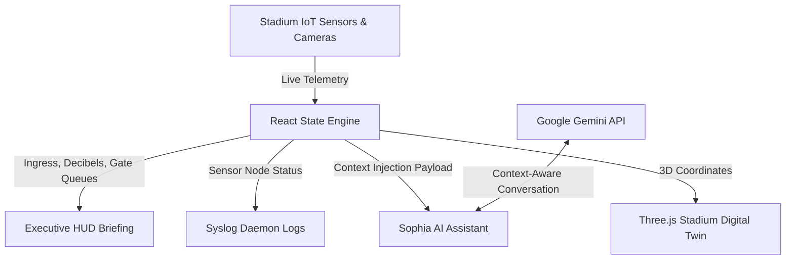

# 🏟️ ArenaAI — FIFA World Cup 2026 Smart Stadium Intelligence

> **Category**: Smart Stadiums & Tournament Operations (PromptWars 2026 Entry)
> 
> *A next-generation Generative AI-powered Command Center engineered to optimize match-day stadium operations, crowd safety, and fan experience for the world's largest sporting event.*

---

## 🌟 The Vision

Managing the logistics of a **FIFA World Cup** stadium requires coordinating crowd flows, security protocols, environmental sensors, and gateway access points across tens of thousands of fans per minute. 

**ArenaAI** bridges the gap between raw, complex IoT sensor data and operational decisions. It provides stadium administrators and logistics coordinators with a cinematic, real-time control cockpit. By injecting live telemetry directly into a localized GenAI assistant (Sophia), ArenaAI translates complex network telemetry, crowd decibels, and gateway wait times into natural language status summaries and proactive mitigations.

---

## 🚀 Key Innovation Highlights

### 1. Context-Aware GenAI Assistant (Sophia AI)
- Powered by Google's `gemini-flash-latest` model.
- **Dynamic Telemetry Injection**: We inject live, real-time stadium metrics (active spectators, current score, gate wait times, security status, and HVAC temperatures) directly into the model's system context.
- **Proactive Coordination**: Sophia does not just reply to queries; she tracks active gates, coordinates medical units, and recommends crowd routing adjustments based on live telemetry inputs.
- **Offline Fallback**: When the API is unreachable, Sophia seamlessly falls back to template responses for critical queries.

### 2. Live Video Telemetry Overlay Map
- A **real-time 3D WebGL digital twin** of the stadium built with Three.js.
- Interactive hotspot pins with raycasting for section-level occupancy, temperature, and status data.
- Proper GPU resource management with full disposal on unmount.

### 3. Asymmetrical Bento-Grid System Control
- A data-rich command center that balances density with user readability.
- **Executive Status Briefing**: A premium HUD banner that translates dense, technical node pings into a simplified human summary.
- **syslog_daemon Logs**: A live-updating terminal log presenting JSON pings, scanner handshakes, and sensor packet reports in real time.
- **sensor_grid_node_matrix**: An active grid tracking 16 IoT sensor points across stadium zones.

### 4. Emergency Response Center
- One-click protocol activation with step-by-step response checklist.
- Real-time coordination contacts for security, medical, and fire units.
- Integrated `aria-pressed` and `role="checkbox"` patterns for full keyboard/screen-reader operability.

---

## 🛠️ Built With the Modern Stack

| Layer | Technology |
|-------|-----------|
| **Core Framework** | React 19 + Vite 8 |
| **Styling** | Tailwind CSS v4 (micro-bordered frosted glass, aurora backdrops, gold accents) |
| **Animations** | Framer Motion 12 (scroll-linked Ken Burns zooms, mouse-parallax layers, floating bokeh motes) |
| **3D Visualization** | Three.js (WebGL stadium digital twin with raycasting) |
| **Charts** | Recharts (custom minimized curves and vertical gradients) |
| **API** | Google Gemini API (`generativelanguage.googleapis.com`) |
| **Testing** | Vitest + React Testing Library + MSW + vitest-axe |
| **Security** | DOMPurify for XSS prevention, Content Security Policy headers |

---

## 🏗️ Architecture & Data Flow



---

## ⚙️ Quick Setup

### 1. Prerequisites
Ensure you have [Node.js](https://nodejs.org/) (v18+) installed.

### 2. Installation
```bash
git clone https://github.com/k-a-v-i-n-0-0-2/promptwars.git
cd promptwars
npm install
```

### 3. Environment Variables
Create a `.env` file in the root directory:
```env
VITE_GEMINI_API_KEY=YOUR_GEMINI_API_KEY
```
> **Note**: `.env` is git-ignored. See `.env.example` for the template.

### 4. Running the Dev Server
```bash
npm run dev
```
Open **http://localhost:5173/** in your browser to experience ArenaAI.

### 5. Running Tests
```bash
npm test              # Run all tests
npm run test:coverage # Run tests with coverage
```

### 6. Building for Production
```bash
npm run build
```

---

## 🔒 Security

- **XSS Prevention**: All AI-generated markdown is sanitized through DOMPurify with a strict allowlist before rendering.
- **Content Security Policy**: A strict CSP meta tag restricts script sources, API connections, and font/image origins.
- **Input Sanitization**: User input to Sophia is trimmed and length-limited (500 chars) before API transmission.
- **Request Timeout**: All API calls use `AbortController` with a 15-second timeout to prevent hanging requests.
- **No Console Leaks**: Error details are handled structurally without `console.error` in production paths.

---

## ♿ Accessibility (WCAG 2.2 AA)

- **Skip Navigation**: A "Skip to content" link is provided for keyboard users.
- **ARIA Landmarks**: All navigation, dialog, and interactive regions are properly labeled with `aria-label`, `role`, and `aria-live`.
- **Focus Management**: `:focus-visible` rings are applied globally for keyboard navigation visibility.
- **Reduced Motion**: A `prefers-reduced-motion` media query disables all animations for users who prefer reduced motion.
- **Screen Reader Support**: The 3D stadium map includes an `aria-label` and screen-reader-only description. Chat messages use `role="log"` with `aria-live="polite"`.

---

## 🧪 Testing

| Suite | Coverage |
|-------|----------|
| **Component Tests** | AIAssistant, DashboardLayout, EmergencyCenter, Overview |
| **Integration Tests** | App navigation flow (landing → dashboard) |
| **Accessibility Tests** | axe-core automated audits for all major views |
| **API Mocking** | MSW (Mock Service Worker) for Gemini API responses |

---

*ArenaAI — Engineered to deliver world-class safety and intelligence for the FIFA World Cup 2026.*
